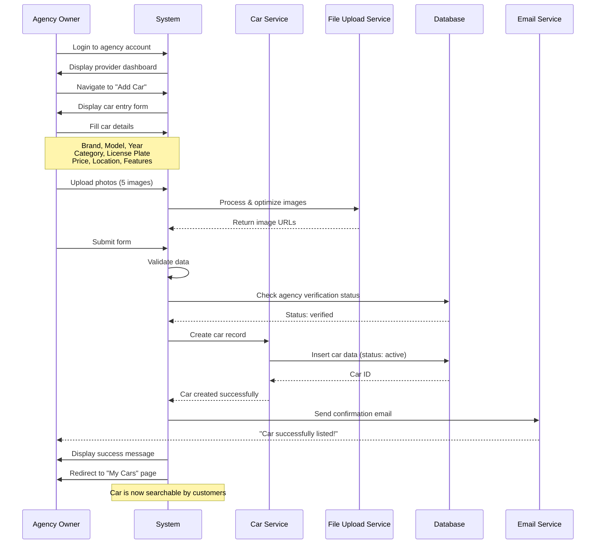

# SwiftCar Car Rental Platform - UML Documentation (Mermaid)

## Table of Contents

1. [Class Diagram](#class-diagram)
2. [Use Case Diagram](#use-case-diagram)
3. [Sequence Diagrams](#sequence-diagrams)
4. [Activity Diagrams](#activity-diagrams)
5. [State Diagrams](#state-diagrams)

---

## 1. Class Diagram

### Core Domain Model for Car Rental Platform

---

## 2. Use Case Diagram

### Customer Use Cases

### Agency Owner Use Cases

### Administrator Use Cases

---

## 3. Sequence Diagrams

### 3.1 Agency Registration & Verification

### 3.2 Customer Booking a Car

### 3.3 Agency Adding a Car

### 3.4 Admin Verifying Agency

---

## 4. Activity Diagrams

### 4.1 Complete Agency Registration & First Car Listing

### 4.2 Customer Booking Flow

### 4.3 Agency Managing Daily Operations

---

## 5. State Diagrams

### 5.1 Agency Verification States

### 5.2 Car States

### 5.3 Booking States

### 5.4 Payment States

### 5.5 Commission States

---

## Summary

This UML documentation provides a complete structural and behavioral view of the SwiftCar car rental platform using Mermaid syntax. The diagrams illustrate:

- **Class Diagram**: Data structure and relationships between core entities
- **Use Case Diagrams**: All user interactions organized by role (Customer, Agency, Admin)
- **Sequence Diagrams**: Step-by-step processes for key workflows
- **Activity Diagrams**: Decision flows and detailed process steps
- **State Diagrams**: Complete lifecycle of entities through various states

These diagrams serve as the blueprint for implementing the React frontend with proper data flow, user interactions, and state management for the SwiftCar platform.
